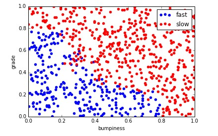
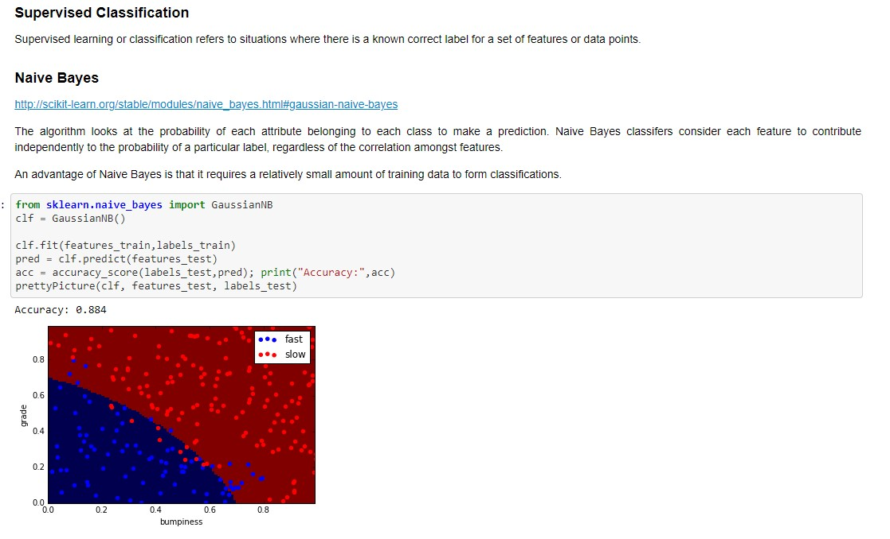

# machine_learning
Machine Learning Resources

Machine Learning - Classification
A quick reference set for machine learning classification based on Udacity's Intro to Machine Learning.

"The future belongs to the companies and people that turn data into products." M.Loukides, 2010.
Data Science and Machine Learning are about the business challenges you’re trying to address, questions you’re looking ask and the data you have available or could look to acquire.

